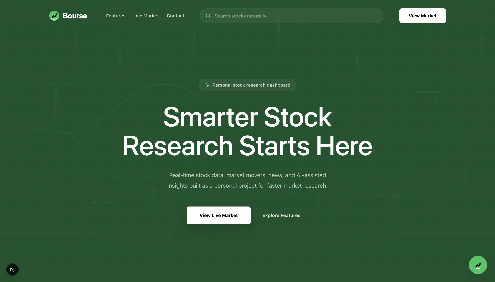
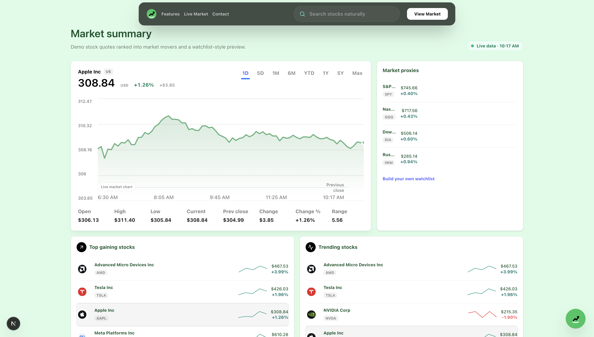
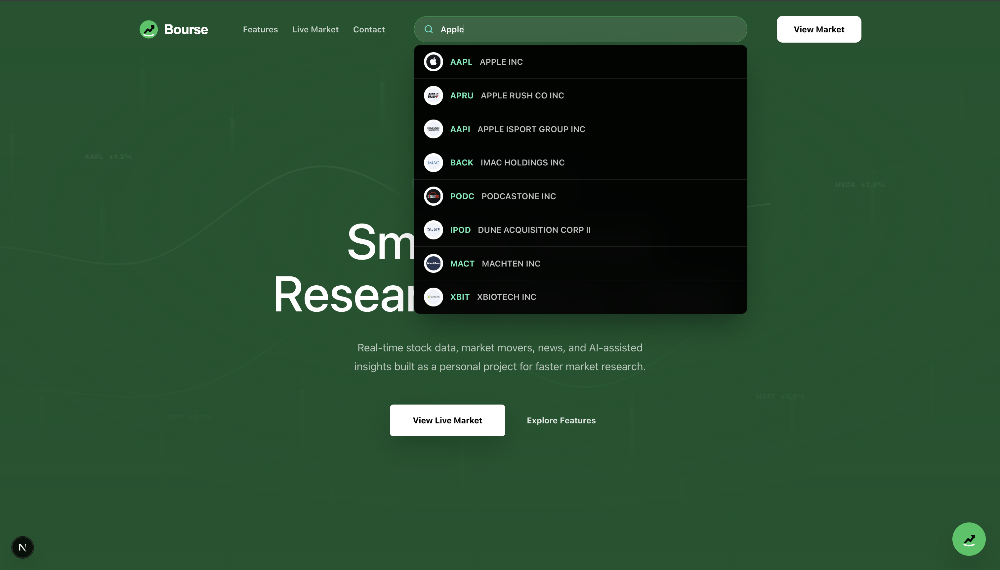
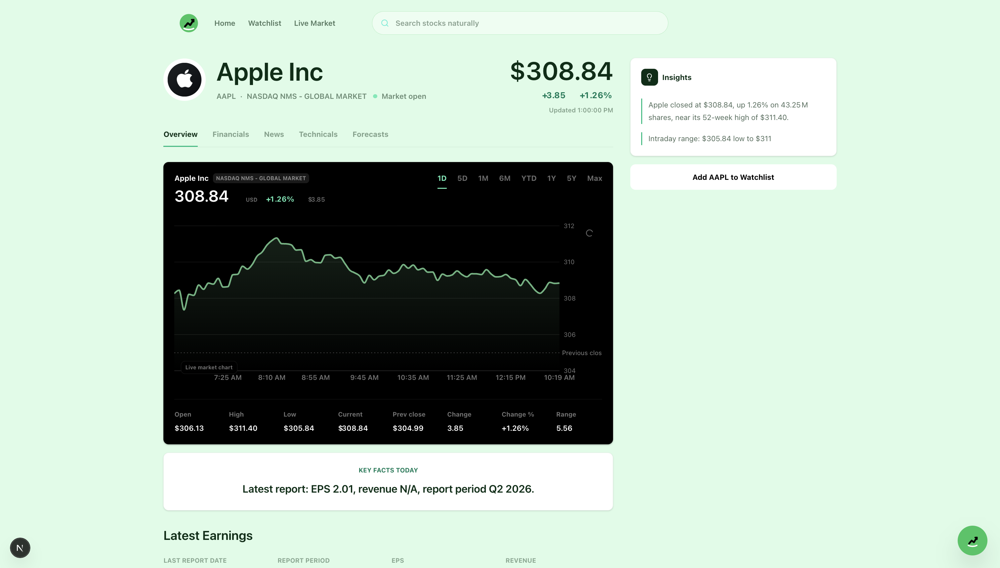
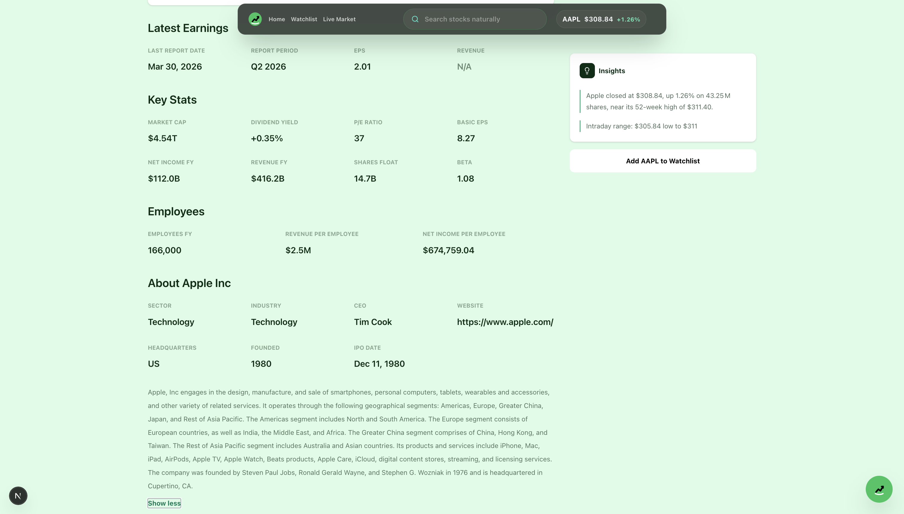
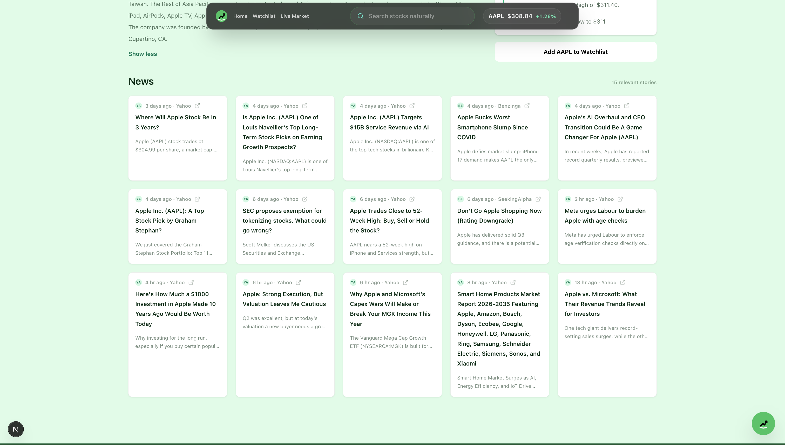
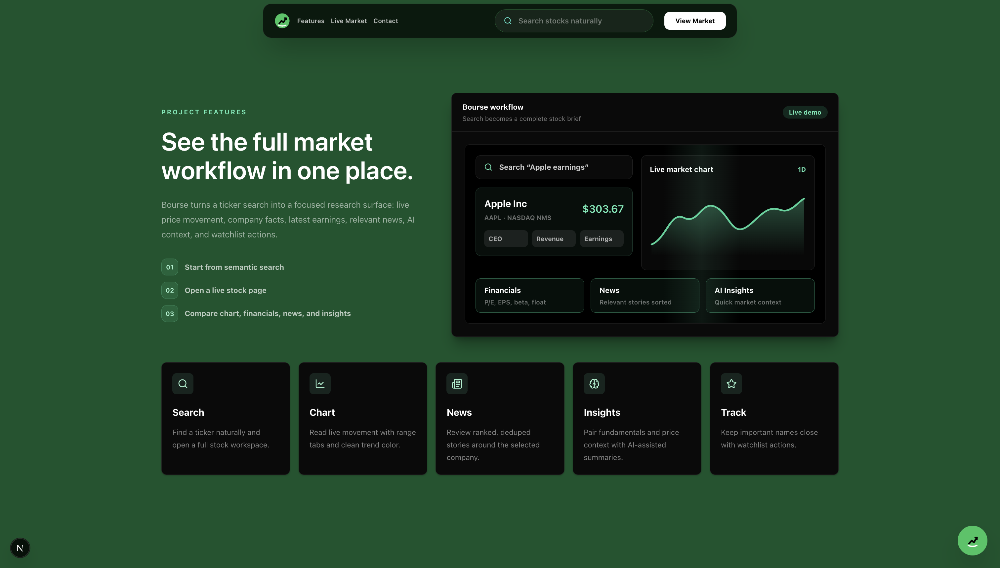
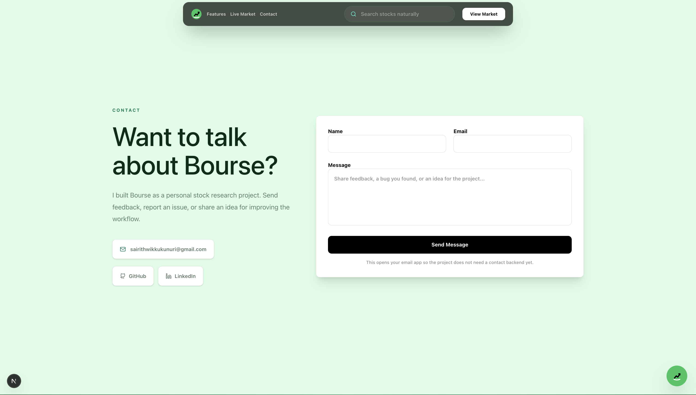
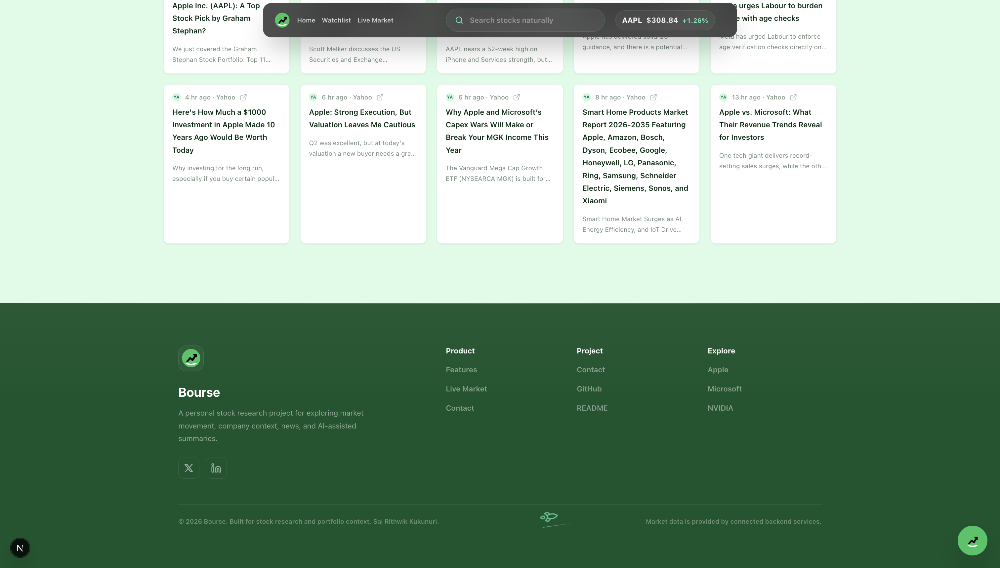

# Bourse — AI Stock Research Platform

Bourse is a stock research platform for exploring companies, tracking market trends, and analyzing U.S. stocks. It includes live market data, company analysis, financial news, and an integrated AI assistant.

## Features

- **Stock Search:** Search and discover U.S. stocks using semantic search and natural-language queries.
- **Market Tracking:** Monitor live prices, trending stocks, and market activity in real time.
- **Company Analysis:** View company details, charts, news, statistics, and AI-powered insights.
- **AI Assistant:** Ask finance-related questions through an integrated AI assistant powered by Groq.
- **Financial News:** Access live company and market news using Finnhub APIs.
- **Responsive UI:** Simple and responsive interface built for market research and stock analysis.

<p align="center">
  
</p>

<div align="center">













</div>

## Getting Started

Bourse is a full-stack stock research platform with a Next.js frontend and a FastAPI backend.

- The frontend handles the user interface and stock dashboard
- The backend handles APIs, stock data, and AI responses

### Local Development

1. Clone the repository

```bash
git clone https://github.com/ZB-ZettaByte/Bourse.git
cd Bourse
```

2. Install frontend dependencies

```bash
pnpm install
```

3. Create a `.env` file in the root directory

```env
NEXT_PUBLIC_FINNHUB_API_KEY=your_finnhub_key
FINNHUB_API_KEY=your_finnhub_key
GROQ_API_KEY=your_groq_key
GROQ_MODEL=openai/gpt-oss-20b
```

4. Create a Python virtual environment

```bash
python -m venv .venv
source .venv/bin/activate
```

5. Install backend dependencies

```bash
pip install -r backend/requirements.txt
```

6. Start the backend server

```bash
.venv/bin/python -m uvicorn backend.main:app --host 127.0.0.1 --port 8000
```

7. Start the frontend

```bash
pnpm run dev
```

8. Open the app

```bash
http://localhost:3000
```

### Author

Sai Rithwik Kukunuri
